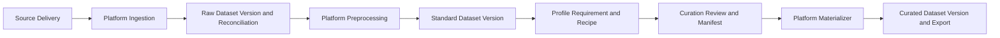

<p align="center">
  <picture>
    <source media="(prefers-color-scheme: dark)" srcset="media/lerobot-logo-thumbnail.png">
    <source media="(prefers-color-scheme: light)" srcset="media/lerobot-logo-thumbnail.png">
    
  </picture>
  <br/>
  <br/>
</p>

<div align="center">

[](https://github.com/huggingface/lerobot/actions/workflows/nightly-tests.yml?query=branch%3Amain)
[](https://codecov.io/gh/huggingface/lerobot)
[](https://www.python.org/downloads/)
[](https://github.com/huggingface/lerobot/blob/main/LICENSE)
[](https://pypi.org/project/lerobot/)
[](https://pypi.org/project/lerobot/)
[](https://github.com/huggingface/lerobot/tree/main/examples)
[](https://github.com/huggingface/lerobot/blob/main/CODE_OF_CONDUCT.md)
[](https://discord.gg/s3KuuzsPFb)

</div>

<br/>

<h3 align="center">
    <p>LeRobot: State-of-the-art AI for real-world robotics</p>
</h3>

---

🤗 LeRobot aims to provide models, datasets, and tools for real-world robotics in PyTorch. The goal is to lower the barrier to entry to robotics so that everyone can contribute and benefit from sharing datasets and pretrained models.

🤗 LeRobot contains state-of-the-art approaches that have been shown to transfer to the real-world with a focus on imitation learning and reinforcement learning.

🤗 LeRobot already provides a set of pretrained models, datasets with human collected demonstrations, and simulation environments to get started without assembling a robot. In the coming weeks, the plan is to add more and more support for real-world robotics on the most affordable and capable robots out there.

🤗 LeRobot hosts pretrained models and datasets on this Hugging Face community page: [huggingface.co/lerobot](https://huggingface.co/lerobot)

## Local Data Platform

### Start the web console

The Data Platform is included with LeRobot and does not require a separate installation. Before
starting it, install this repository by following the [Installation](#installation) instructions
below.

Start the platform with a directory containing one or more local datasets:

```bash
python -m lerobot.data_platform --root /path/to/datasets
```

The home page recursively discovers directories containing `meta/info.json` and exposes two
logical workspaces in the same process:

- **Data Platform** is the supply and execution plane for ingestion, preprocessing, immutable
  dataset versions, lineage, and materialization.
- **Data Curation** is the decision plane for exploration, quality review, annotation, cohort
  selection, profiling, versioned requirements/recipes, and dataset construction.

The two workspaces continue to share the dataset selector, Viewer, Job & Artifacts panel, and
operation audit log. The implementation lives in [`lerobot/data_platform`](lerobot/data_platform).

The platform always operates on real LeRobot metadata and trajectory data. It reports invalid
inputs instead of replacing them with fabricated samples. Data Construction also preserves the
source observation and action values; it creates training variants by changing task metadata,
bookkeeping indices, and `exist_label`.

### Platform overview



Published raw, standard, and curated dataset versions are immutable. Stable `episode_uid` values
live in portable Identity Artifacts outside dataset roots; physical copies are registered as
`DatasetReplica` records. Curation edits first live in revision-controlled Workspaces and are
frozen into versioned manifests. Versioned preprocessing/materialization Profiles separate
content-affecting configuration from runtime options. The materializer is idempotent, persists its
state in SQLite, validates row counts, timestamps, metadata, and complete file SHA256 values, then
atomically registers the logical version and output replica.

### Modules and capabilities

| Domain | Main modules | What the UI can do |
| --- | --- | --- |
| Platform — ingestion and versions | `lifecycle.py`, `lifecycle_repository.py`, `routes/lifecycle.py` | Full-hash local datasets, register immutable versions/replicas and portable identity artifacts, inspect explicit episode lineage. |
| Platform — delivery and reconciliation | `lifecycle.py`, `routes/lifecycle.py` | Register source deliveries and explain every received/accepted/excluded/repaired/generated Episode transition. |
| Platform — preprocessing and materialization | `precompute/preprocess/`, `lifecycle.py` | Execute versioned Profiles and idempotently materialize a published manifest through a persisted validation state machine. |
| Curation — understand and quality | `viewer.py`, `precompute/analysis.py`, `precompute/compare/`, `precompute/embedding/`, `precompute/preprocess/quality_flags.py` | Explore trajectories, distributions, embeddings, comparisons, technical issues, and semantic quality evidence. |
| Curation — enrichment and selection | `precompute/annotation.py`, `precompute/labeling/`, `precompute/tagging/`, `precompute/construction/` | Edit revision-controlled Workspaces containing stage, prompt, bbox, tag, include/exclude, trim, and value-edit decisions before publishing a manifest. |
| Curation — profile and recipe | `lifecycle.py`, `routes/lifecycle.py` | Publish Dataset Profiles and Requirements, resolve fixed cohorts, and compile deterministic Recipes into reviewable Workspaces. |

The data-processing area is divided into smaller modules:

| Processing module | Capabilities |
| --- | --- |
| Feature conversion (`action_dim.py`, `field_ops.py`) | Trim action/state vectors to a target dimension and remove selected fields from parquet data and feature metadata. |
| Signal processing (`smooth_action.py`) | Apply centered temporal smoothing to action values and, when requested, state values. |
| Dataset standardization (`standardize.py`) | Run the platform's combined cleanup pipeline: normalize DVT2 grippers, align action/state dimensions, remove depth fields, write stage/subtask data, and repair indices. |
| Dataset composition (`dataset_split.py`, `dataset_merge.py`, `dataset_subtract.py`) | Create task/episode subsets, combine datasets with remapped metadata, or remove episodes that exactly match episodes in other datasets. |
| Quality and metadata repair (`quality_flags.py`, `flag_fixes.py`, `flag_clear.py`, `prompt_rewrite.py`) | Detect data-quality problems, apply supported repairs, review task/prompt assignments, and clear resolved flags. |
| Episode maintenance (`delete_episodes.py`) | Delete selected episodes in place, reindex the remaining data and metadata, and attempt rollback if the operation fails. |

The default console path does not expose direct source-dataset mutation controls. Cache,
analysis, Workspaces, manifests, and lifecycle records live outside the source dataset; preprocessing
and materialization create sibling outputs. The normal startup command also provides a password-
protected Admin Mode in the browser. On first entry, set the local administrator password for that
dataset root; later entries require the same password. The password is stored only as a salted hash,
and Admin Mode remains active until explicitly exited or the browser session ends. Episode deletion
requires an impact confirmation and a reason recorded in the operation audit log.

To mark one or more read-only source zones at startup, repeat `--protected-source-root`. The console
also exposes the same policy on the Datasets page. Protected datasets can be reviewed and used to
create sibling outputs, but every legacy in-place delete, repair, or overwrite request is rejected.

```bash
python -m lerobot.data_platform \
  --root /path/to/datasets \
  --protected-source-root /path/to/raw_data
```

Admin Mode can modify or delete source Parquet, videos, and metadata and should not be used for
normal curation work.

See [`docs/data_lifecycle_architecture.md`](docs/data_lifecycle_architecture.md) for the capability
matrix, persisted contracts, API mapping, lifecycle states, and materialization invariants.


## Installation

Download our source code:
```bash
git clone https://github.com/Beaconsyh08/data_platform.git
cd data_platform
```

Create a virtual environment with Python 3.10 and activate it, e.g. with [`miniconda`](https://docs.anaconda.com/free/miniconda/index.html):
```bash
conda create -y -n lerobot python=3.10
conda activate lerobot
```

When using `miniconda`, install `ffmpeg` in your environment:
```bash
conda install ffmpeg -c conda-forge
```

> **NOTE:** This usually installs `ffmpeg 7.X` for your platform compiled with the `libsvtav1` encoder. If `libsvtav1` is not supported (check supported encoders with `ffmpeg -encoders`), you can:
>  - _[On any platform]_ Explicitly install `ffmpeg 7.X` using:
>  ```bash
>  conda install ffmpeg=7.1.1 -c conda-forge
>  ```
>  - _[On Linux only]_ Install [ffmpeg build dependencies](https://trac.ffmpeg.org/wiki/CompilationGuide/Ubuntu#GettheDependencies) and [compile ffmpeg from source with libsvtav1](https://trac.ffmpeg.org/wiki/CompilationGuide/Ubuntu#libsvtav1), and make sure you use the corresponding ffmpeg binary to your install with `which ffmpeg`.

Install 🤗 LeRobot:
```bash
pip install -e .
```

> **NOTE:** If you encounter build errors, you may need to install additional dependencies (`cmake`, `build-essential`, and `ffmpeg libs`). On Linux, run:
`sudo apt-get install cmake build-essential python3-dev pkg-config libavformat-dev libavcodec-dev libavdevice-dev libavutil-dev libswscale-dev libswresample-dev libavfilter-dev pkg-config`. For other systems, see: [Compiling PyAV](https://pyav.org/docs/develop/overview/installation.html#bring-your-own-ffmpeg)

For simulations, 🤗 LeRobot comes with gymnasium environments that can be installed as extras:
- [aloha](https://github.com/huggingface/gym-aloha)
- [xarm](https://github.com/huggingface/gym-xarm)
- [pusht](https://github.com/huggingface/gym-pusht)

For instance, to install 🤗 LeRobot with aloha and pusht, use:
```bash
pip install -e ".[aloha, pusht]"
```

To use [Weights and Biases](https://docs.wandb.ai/quickstart) for experiment tracking, log in with
```bash
wandb login
```

(note: you will also need to enable WandB in the configuration. See below.)

## Walkthrough

```
.
├── examples             # contains demonstration examples, start here to learn about LeRobot
|   └── advanced         # contains even more examples for those who have mastered the basics
├── lerobot
|   ├── configs          # contains config classes with all options that you can override in the command line
|   ├── common           # contains classes and utilities
|   |   ├── datasets       # various datasets of human demonstrations: aloha, pusht, xarm
|   |   ├── envs           # various sim environments: aloha, pusht, xarm
|   |   ├── policies       # various policies: act, diffusion, tdmpc
|   |   ├── robot_devices  # various real devices: dynamixel motors, opencv cameras, koch robots
|   |   └── utils          # various utilities
|   └── scripts          # contains functions to execute via command line
|       ├── eval.py                 # load policy and evaluate it on an environment
|       ├── train.py                # train a policy via imitation learning and/or reinforcement learning
|       ├── control_robot.py        # teleoperate a real robot, record data, run a policy
|       ├── push_dataset_to_hub.py  # convert your dataset into LeRobot dataset format and upload it to the Hugging Face hub
|       └── visualize_dataset.py    # load a dataset and render its demonstrations
├── outputs               # contains results of scripts execution: logs, videos, model checkpoints
└── tests                 # contains pytest utilities for continuous integration
```

### The `LeRobotDataset` format

A dataset in `LeRobotDataset` format is very simple to use. It can be loaded from a repository on the Hugging Face hub or a local folder simply with e.g. `dataset = LeRobotDataset("lerobot/aloha_static_coffee")` and can be indexed into like any Hugging Face and PyTorch dataset. For instance `dataset[0]` will retrieve a single temporal frame from the dataset containing observation(s) and an action as PyTorch tensors ready to be fed to a model.

A specificity of `LeRobotDataset` is that, rather than retrieving a single frame by its index, we can retrieve several frames based on their temporal relationship with the indexed frame, by setting `delta_timestamps` to a list of relative times with respect to the indexed frame. For example, with `delta_timestamps = {"observation.image": [-1, -0.5, -0.2, 0]}`  one can retrieve, for a given index, 4 frames: 3 "previous" frames 1 second, 0.5 seconds, and 0.2 seconds before the indexed frame, and the indexed frame itself (corresponding to the 0 entry). See example [1_load_lerobot_dataset.py](examples/1_load_lerobot_dataset.py) for more details on `delta_timestamps`.

Under the hood, the `LeRobotDataset` format makes use of several ways to serialize data which can be useful to understand if you plan to work more closely with this format. We tried to make a flexible yet simple dataset format that would cover most type of features and specificities present in reinforcement learning and robotics, in simulation and in real-world, with a focus on cameras and robot states but easily extended to other types of sensory inputs as long as they can be represented by a tensor.

Here are the important details and internal structure organization of a typical `LeRobotDataset` instantiated with `dataset = LeRobotDataset("lerobot/aloha_static_coffee")`. The exact features will change from dataset to dataset but not the main aspects:

```
dataset attributes:
  ├ hf_dataset: a Hugging Face dataset (backed by Arrow/parquet). Typical features example:
  │  ├ observation.images.cam_high (VideoFrame):
  │  │   VideoFrame = {'path': path to a mp4 video, 'timestamp' (float32): timestamp in the video}
  │  ├ observation.state (list of float32): position of an arm joints (for instance)
  │  ... (more observations)
  │  ├ action (list of float32): goal position of an arm joints (for instance)
  │  ├ episode_index (int64): index of the episode for this sample
  │  ├ frame_index (int64): index of the frame for this sample in the episode ; starts at 0 for each episode
  │  ├ timestamp (float32): timestamp in the episode
  │  ├ next.done (bool): indicates the end of an episode ; True for the last frame in each episode
  │  └ index (int64): general index in the whole dataset
  ├ episode_data_index: contains 2 tensors with the start and end indices of each episode
  │  ├ from (1D int64 tensor): first frame index for each episode — shape (num episodes,) starts with 0
  │  └ to: (1D int64 tensor): last frame index for each episode — shape (num episodes,)
  ├ stats: a dictionary of statistics (max, mean, min, std) for each feature in the dataset, for instance
  │  ├ observation.images.cam_high: {'max': tensor with same number of dimensions (e.g. `(c, 1, 1)` for images, `(c,)` for states), etc.}
  │  ...
  ├ info: a dictionary of metadata on the dataset
  │  ├ codebase_version (str): this is to keep track of the codebase version the dataset was created with
  │  ├ fps (float): frame per second the dataset is recorded/synchronized to
  │  ├ video (bool): indicates if frames are encoded in mp4 video files to save space or stored as png files
  │  └ encoding (dict): if video, this documents the main options that were used with ffmpeg to encode the videos
  ├ videos_dir (Path): where the mp4 videos or png images are stored/accessed
  └ camera_keys (list of string): the keys to access camera features in the item returned by the dataset (e.g. `["observation.images.cam_high", ...]`)
```

A `LeRobotDataset` is serialised using several widespread file formats for each of its parts, namely:
- hf_dataset stored using Hugging Face datasets library serialization to parquet
- videos are stored in mp4 format to save space
- metadata are stored in plain json/jsonl files

Dataset can be uploaded/downloaded from the HuggingFace hub seamlessly. To work on a local dataset, you can specify its location with the `root` argument if it's not in the default `~/.cache/huggingface/lerobot` location.

### Evaluate a pretrained policy

Check out [example 2](./examples/2_evaluate_pretrained_policy.py) that illustrates how to download a pretrained policy from Hugging Face hub, and run an evaluation on its corresponding environment.

We also provide a more capable script to parallelize the evaluation over multiple environments during the same rollout. Here is an example with a pretrained model hosted on [lerobot/diffusion_pusht](https://huggingface.co/lerobot/diffusion_pusht):
```bash
python lerobot/scripts/eval.py \
    --policy.path=lerobot/diffusion_pusht \
    --env.type=pusht \
    --eval.batch_size=10 \
    --eval.n_episodes=10 \
    --policy.use_amp=false \
    --policy.device=cuda
```

Note: After training your own policy, you can re-evaluate the checkpoints with:

```bash
python lerobot/scripts/eval.py --policy.path={OUTPUT_DIR}/checkpoints/last/pretrained_model
```

See `python lerobot/scripts/eval.py --help` for more instructions.

### Train your own policy

Check out [example 3](./examples/3_train_policy.py) that illustrates how to train a model using our core library in python, and [example 4](./examples/4_train_policy_with_script.md) that shows how to use our training script from command line.

To use wandb for logging training and evaluation curves, make sure you've run `wandb login` as a one-time setup step. Then, when running the training command above, enable WandB in the configuration by adding `--wandb.enable=true`.

A link to the wandb logs for the run will also show up in yellow in your terminal. Here is an example of what they look like in your browser. Please also check [here](./examples/4_train_policy_with_script.md#typical-logs-and-metrics) for the explanation of some commonly used metrics in logs.


Note: For efficiency, during training every checkpoint is evaluated on a low number of episodes. You may use `--eval.n_episodes=500` to evaluate on more episodes than the default. Or, after training, you may want to re-evaluate your best checkpoints on more episodes or change the evaluation settings. See `python lerobot/scripts/eval.py --help` for more instructions.

#### Reproduce state-of-the-art (SOTA)

We provide some pretrained policies on our [hub page](https://huggingface.co/lerobot) that can achieve state-of-the-art performances.
You can reproduce their training by loading the config from their run. Simply running:
```bash
python lerobot/scripts/train.py --config_path=lerobot/diffusion_pusht
```
reproduces SOTA results for Diffusion Policy on the PushT task.

## Contribute

If you would like to contribute to 🤗 LeRobot, please check out our [contribution guide](https://github.com/huggingface/lerobot/blob/main/CONTRIBUTING.md).

<!-- ### Add a new dataset

To add a dataset to the hub, you need to login using a write-access token, which can be generated from the [Hugging Face settings](https://huggingface.co/settings/tokens):
```bash
huggingface-cli login --token ${HUGGINGFACE_TOKEN} --add-to-git-credential
```

Then point to your raw dataset folder (e.g. `data/aloha_static_pingpong_test_raw`), and push your dataset to the hub with:
```bash
python lerobot/scripts/push_dataset_to_hub.py \
--raw-dir data/aloha_static_pingpong_test_raw \
--out-dir data \
--repo-id lerobot/aloha_static_pingpong_test \
--raw-format aloha_hdf5
```

See `python lerobot/scripts/push_dataset_to_hub.py --help` for more instructions.

If your dataset format is not supported, implement your own in `lerobot/common/datasets/push_dataset_to_hub/${raw_format}_format.py` by copying examples like [pusht_zarr](https://github.com/huggingface/lerobot/blob/main/lerobot/common/datasets/push_dataset_to_hub/pusht_zarr_format.py), [umi_zarr](https://github.com/huggingface/lerobot/blob/main/lerobot/common/datasets/push_dataset_to_hub/umi_zarr_format.py), [aloha_hdf5](https://github.com/huggingface/lerobot/blob/main/lerobot/common/datasets/push_dataset_to_hub/aloha_hdf5_format.py), or [xarm_pkl](https://github.com/huggingface/lerobot/blob/main/lerobot/common/datasets/push_dataset_to_hub/xarm_pkl_format.py). -->


### Add a pretrained policy

Once you have trained a policy you may upload it to the Hugging Face hub using a hub id that looks like `${hf_user}/${repo_name}` (e.g. [lerobot/diffusion_pusht](https://huggingface.co/lerobot/diffusion_pusht)).

You first need to find the checkpoint folder located inside your experiment directory (e.g. `outputs/train/2024-05-05/20-21-12_aloha_act_default/checkpoints/002500`). Within that there is a `pretrained_model` directory which should contain:
- `config.json`: A serialized version of the policy configuration (following the policy's dataclass config).
- `model.safetensors`: A set of `torch.nn.Module` parameters, saved in [Hugging Face Safetensors](https://huggingface.co/docs/safetensors/index) format.
- `train_config.json`: A consolidated configuration containing all parameters used for training. The policy configuration should match `config.json` exactly. This is useful for anyone who wants to evaluate your policy or for reproducibility.

To upload these to the hub, run the following:
```bash
huggingface-cli upload ${hf_user}/${repo_name} path/to/pretrained_model
```

See [eval.py](https://github.com/huggingface/lerobot/blob/main/lerobot/scripts/eval.py) for an example of how other people may use your policy.


### Improve your code with profiling

An example of a code snippet to profile the evaluation of a policy:
```python
from torch.profiler import profile, record_function, ProfilerActivity

def trace_handler(prof):
    prof.export_chrome_trace(f"tmp/trace_schedule_{prof.step_num}.json")

with profile(
    activities=[ProfilerActivity.CPU, ProfilerActivity.CUDA],
    schedule=torch.profiler.schedule(
        wait=2,
        warmup=2,
        active=3,
    ),
    on_trace_ready=trace_handler
) as prof:
    with record_function("eval_policy"):
        for i in range(num_episodes):
            prof.step()
            # insert code to profile, potentially whole body of eval_policy function
```

## Citation

If you want, you can cite this work with:
```bibtex
@misc{cadene2024lerobot,
    author = {Cadene, Remi and Alibert, Simon and Soare, Alexander and Gallouedec, Quentin and Zouitine, Adil and Palma, Steven and Kooijmans, Pepijn and Aractingi, Michel and Shukor, Mustafa and Aubakirova, Dana and Russi, Martino and Capuano, Francesco and Pascale, Caroline and Choghari, Jade and Moss, Jess and Wolf, Thomas},
    title = {LeRobot: State-of-the-art Machine Learning for Real-World Robotics in Pytorch},
    howpublished = "\url{https://github.com/huggingface/lerobot}",
    year = {2024}
}
```

Additionally, if you are using any of the particular policy architecture, pretrained models, or datasets, it is recommended to cite the original authors of the work as they appear below:

- [Diffusion Policy](https://diffusion-policy.cs.columbia.edu)
```bibtex
@article{chi2024diffusionpolicy,
	author = {Cheng Chi and Zhenjia Xu and Siyuan Feng and Eric Cousineau and Yilun Du and Benjamin Burchfiel and Russ Tedrake and Shuran Song},
	title ={Diffusion Policy: Visuomotor Policy Learning via Action Diffusion},
	journal = {The International Journal of Robotics Research},
	year = {2024},
}
```
- [ACT or ALOHA](https://tonyzhaozh.github.io/aloha)
```bibtex
@article{zhao2023learning,
  title={Learning fine-grained bimanual manipulation with low-cost hardware},
  author={Zhao, Tony Z and Kumar, Vikash and Levine, Sergey and Finn, Chelsea},
  journal={arXiv preprint arXiv:2304.13705},
  year={2023}
}
```

- [TDMPC](https://www.nicklashansen.com/td-mpc/)

```bibtex
@inproceedings{Hansen2022tdmpc,
	title={Temporal Difference Learning for Model Predictive Control},
	author={Nicklas Hansen and Xiaolong Wang and Hao Su},
	booktitle={ICML},
	year={2022}
}
```

- [VQ-BeT](https://sjlee.cc/vq-bet/)
```bibtex
@article{lee2024behavior,
  title={Behavior generation with latent actions},
  author={Lee, Seungjae and Wang, Yibin and Etukuru, Haritheja and Kim, H Jin and Shafiullah, Nur Muhammad Mahi and Pinto, Lerrel},
  journal={arXiv preprint arXiv:2403.03181},
  year={2024}
}
```
