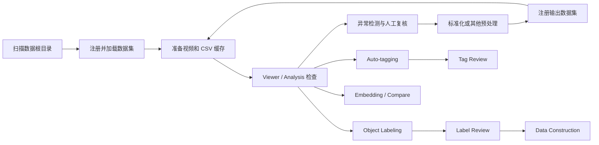

# Data Platform 页面功能与操作手册

> 适用范围：当前仓库 `lerobot.data_platform` Web 页面，包含首页工作台、Viewer、Analysis、Labeling、Construction、Tagging、Embedding、Smoothing 和 Compare 页面。  
> 页面默认地址：`http://127.0.0.1:9091`。本文按当前代码整理，更新时间为 2026-08-19。

## 1. 这套页面是做什么的

Data Platform 页面不是单纯的数据浏览器，而是一套本地 LeRobot 数据集工作台，主要完成下面几类工作：

- 注册并管理本地数据集；
- 生成视频和 CSV 浏览缓存；
- 查看 episode 的视频、Action、State、Stage、任务和标签；
- 检测异常 episode，并进行人工标记、修复、裁剪或删除；
- 标准化、转换、平滑、拆分、合并或相减数据集；
- 进行目标框标注、自动标签和合成数据构造；
- 生成数据分析、策略 Embedding 和数据集对比结果；
- 在右侧统一查看后台任务、产物入口和操作审计记录。

推荐把它理解为下面这条流水线：



## 2. 启动页面

### 2.1 启动完整工作台

`--root` 应指向“包含一个或多个数据集文件夹的父目录”，不是必须指向某一个具体数据集。

```bash
cd /home/yuhao.song/Codes/data_platform
.venv/bin/python -m lerobot.data_platform \
  --root /path/to/datasets_root \
  --host 127.0.0.1 \
  --port 9091
```

启动后打开：

```text
http://127.0.0.1:9091
```

如果当前环境使用 `uv`，也可以把 `.venv/bin/python` 换成 `uv run python`。

### 2.2 远程机器上的页面

建议让服务仍然监听远端 `127.0.0.1`，在本地建立 SSH 隧道：

```bash
ssh -L 9091:127.0.0.1:9091 user@remote-host
```

然后在本地浏览器打开 `http://127.0.0.1:9091`。

### 2.3 `full` 和 `visualize` 两种模式

| 模式 | 启动参数 | 页面范围 | 是否只读 |
|---|---|---|---|
| 完整模式 | `--mode full`，默认 | Preprocess、Annotate、Synthesize、Analyze 全部功能 | 否 |
| 精简模式 | `--mode visualize` | Cache、Abnormal Flags、Dataset Ops、Viewer、Analysis | **否** |

`visualize` 只是减少可见功能，不是只读模式。它仍然允许异常修复、prompt 小写化、清除 flag 和删除 episode。

## 3. 首页布局和通用操作

首页分为三列：

| 区域 | 用途 |
|---|---|
| 左侧 `Datasets` | 扫描、注册、加载、搜索、选择或移除数据集 |
| 中间功能区 | 执行 Preprocess、Annotate、Synthesize、Analyze 任务 |
| 右侧 `Job & Artifacts` | 查看任务进度、日志、结果页面和操作历史 |

### 3.1 第一次加载数据集

1. 在左侧 `root_dir` 输入数据集父目录。
2. 点击 `Scan`。
3. 切到 `Available`，查看扫描到的目录。
4. 选择一个或多个数据集，点击 `Register selected`；单个数据集也可点击 `Register / Load`。
5. 切回 `Registered`，点击数据集名称加载完整元数据。
6. 选中数据集后，再到中间功能区执行操作。

扫描规则主要识别：

- 存在 `meta/info.json` 的 LeRobot 数据集；
- 已经存在 Viewer cache、但原始数据集当前不可用的 cache-only 项目。

### 3.2 `Registered`、`Available` 和 `cache-only`

- `Available`：在 `root_dir` 下扫描到、但尚未注册到当前工作台的目录。
- `Registered`：已保存到工作台注册表的项目。
- `cache-only`：只能使用已有可视化缓存，不能执行需要原始 Parquet/视频的数据写回操作。
- 点击 `remove` 只会从工作台注册表移除，不会删除数据集文件。

### 3.3 通用参数

| 参数 | 含义 | 建议 |
|---|---|---|
| `data format` | DVT1 或 DVT2 数据规则 | 能自动识别时保持默认；已知格式时再手动覆盖 |
| `episodes` | 指定 episode 子集 | 留空表示全部；试跑可填 `0 1 2` |
| `workers` | 并行 worker 数 | CPU/NFS 忙时调低，避免多个大任务同时跑 |
| `downsample` | CSV 曲线显示采样步长 | 只影响浏览曲线密度；例如 5 表示每 5 行取 1 行 |
| `output root` | 新数据集输出路径 | 优先写到源数据集旁边的独立目录 |
| `Dry run only` | 只计算计划和摘要，不真正写入 | 对转换、改名、拆分、合并、相减等操作建议先勾选 |
| `Overwrite` | 覆盖已有输出或缓存 | 确认输出目录和数据集无误后再启用 |

## 4. 先看清楚：哪些功能会改数据

| 功能 | 写入位置 | 是否修改源数据集 | 风险等级 |
|---|---|---:|---|
| 注册、加载、从列表移除 | 工作台注册表 | 否 | 低 |
| Cache | `vis/local_vis_<dataset>/` | 否；可能覆盖缓存 | 低 |
| Analysis、Embedding、Compare | 可视化/分析缓存 | 否 | 低 |
| Viewer 手工 flag、临时 tag | local_vis sidecar | 否，合并前只在缓存 | 低 |
| Stage 编辑未完成时保存 | annotation cache 和 CSV | 否 | 中 |
| Stage 编辑完成后保存 | annotation cache、CSV、源 Parquet/meta/stats | **是** | 高 |
| Abnormal Flags 检测/清除 | flag 和 issue 缓存 | 通常否 | 中 |
| Abnormal Flags 一键修复 | 源 Parquet/meta/cache | **是** | 高 |
| Standardize | 新的 sibling 数据集 | 否 | 中 |
| Convert action/state、Convert v3、Drop field、Smooth action | 新的 sibling 数据集 | 否 | 中 |
| Repair v3 video timestamps | 源 MP4 和 v3 episode metadata | **是** | 高 |
| Rewrite prompts、Fix prepositions、Apply pending prompts | 源 metadata；部分操作还改 Parquet `task_index` | **是** | 高 |
| Delete episodes、Viewer `DEL`、Trim `Apply` | 源数据集 | **是，且删除不可逆** | 极高 |
| Split、Merge、Subtract | 新的 sibling 数据集 | 否 | 中 |
| Object Labeling / Auto-tagging 运行 | local_vis 标注或标签结果 | 否 | 中 |
| `Merge to metadata` | 源 episode metadata | **是** | 高 |
| Data Construction | 新合成数据集 | 否 | 中 |
| Construction `Finalize rejected` | 合成输出数据集 | **是，删除已拒绝 episode** | 高 |

执行高风险操作前，建议：

1. 确认右上角当前选中的数据集名称和路径；
2. 能 dry-run 的操作先 dry-run；
3. 查看右侧任务摘要和 `output`；
4. 对原地删除、裁剪、timestamp repair 和 metadata merge 先保留备份；
5. 等当前任务结束后再启动下一个写任务。

## 5. Preprocess：预处理功能

### 5.1 Cache

用途：生成 Viewer 所需的视频和 CSV 缓存，不修改源数据集。

操作步骤：

1. 选择数据集并确保已加载 metadata。
2. 打开 `Preprocess > Cache`。
3. 选择数据格式、episode 范围、downsample 和 workers。
4. 勾选 `Prepare videos`、`Prepare CSV`。
5. 第一次运行不要勾选覆盖；需要重建时再选：
   - `Recompute all cache`：重建视频和 CSV；
   - `Recompute CSV only`：只重建 CSV，保留视频。
6. 点击 `Prepare cache`。
7. 等右侧任务完成后点击 `Viewer`。

默认缓存目录是数据集相邻的：

```text
<dataset_parent>/vis/local_vis_<dataset_name>/
```

v3.0 数据集使用只读适配器生成 Viewer cache，准备 cache 的过程不会修改 v3 源数据。

### 5.2 Stage & Subtask

用途：自动计算或人工修订 Stage/Subtask，生成阶段曲线和文本标签。

主要选项：

| 选项 | 作用 |
|---|---|
| `fallback stage count` | 对不匹配 pick/place/give 规则的任务按时间等分，默认 5 段 |
| `Repair episode indices` | 修复 `frame_index`、`timestamp`、`index` |
| `Force stage recompute` | 忽略已有阶段，重新计算 |
| `Write stage to parquet` | 把 `subtask_state` 写回 Parquet |
| `Write subtask text` | 根据 stage 写入 subtask 文本 |
| `Overwrite subtask text` | 覆盖已有 subtask 文本列 |
| `Overwrite parquet labels` | 强制重算并写入 stage/subtask，同时重建 CSV |

推荐用法：

1. 首次只选择少量 episodes，所有红色写回选项保持关闭。
2. 运行后在 Viewer 检查 Stage 曲线和边界。
3. 确认规则正确后，再按需要启用 Parquet/meta 写回选项。

红色 `Dataset mutations` 中的选项会修改源数据，默认关闭。

### 5.3 Abnormal Flags

用途：扫描 Action、State、`subtask_state` 和 prompt，标记可疑 episode。

当前自动规则包括：

- 前 0.3 秒内出现 gripper 过早变化；
- 缺少可用的 `subtask_state` 分段；
- State 显示 gripper 持续闭合，但 Action 仍接近零；
- State gripper 发生变化，但附近没有对应的 Action 变化；
- 关节出现重复或同步归零尖峰；
- prompt 包含逗号或句号，被视为多句 prompt；
- 单个 episode 被分配了多个不同 task。

操作步骤：

1. 选择 `data format`、workers 和可选 episode 范围。
2. 如需替换上一次自动检测结果，勾选 `Overwrite previous abnormal results`。
3. 只有确实要一起移除人工 flag 时，才勾选 `Also clear manual flags`。
4. 点击 `Detect flags`。
5. 打开 Viewer，使用 `flagged` 和 flag 类型筛选逐条复核。

一键操作：

| 按钮 | 作用 | 是否改源数据 |
|---|---|---:|
| `Normalize prompts to lowercase` | prompt 转小写，并处理重复 task/task_index | 是 |
| `Trim first frame for early gripper transition` | 删除命中 episode 的第一帧并重建相关数据 | 是 |
| `Set stuck closed gripper action to closed` | 修复 gripper Action | 是 |
| `Add action lead for state-only gripper transition` | 为 State-only 变化补 Action 提前量 | 是 |
| `Delete all flagged episodes` | 删除所有当前 flagged episodes | **是，不可逆** |
| `Clear all flags` | 清除 flag/issue 结果 | 通常不改 Parquet，但会清除复核状态 |

不要把“被 flag”直接等同于“应该删除”。建议先在 Viewer 按原因筛选，再决定修复或删除。

### 5.4 Standardize

用途：生成训练就绪的 16D Action/State sibling 数据集，源数据集不修改。

标准化流程会：

- 缺 cache 时先准备 cache；
- 按 DVT2 规则归一化 gripper 第 7/15 维；
- 把 Action/State 截到 16D；
- 删除 depth 字段；
- 写入 Stage/Subtask；
- 修复 episode/frame 索引。

操作步骤：

1. 打开 `Preprocess > Standardize`。
2. 选择 DVT1/DVT2 和 workers。
3. 如需仅从输出中排除部分 episode，在 `delete episodes` 填 `1,3-10,12`。
4. 第一次建议勾选 `Dry run only`。
5. 确认右侧摘要后取消 dry-run，再运行 `Standardize dataset`。
6. 默认输出为稳定路径 `<src>_preprocessed`；已有目录时必须明确勾选覆盖。
7. 完成后输出数据集会注册到页面，再对它准备 cache 并复核。

### 5.5 Transform

`Transform` 用于生成 schema/feature 变化后的 sibling 数据集，只有 v3 timestamp repair 是原地修改。

| 操作 | 用途 | 关键参数 | 输出行为 |
|---|---|---|---|
| `Convert action/state dim` | 调整 Action/State 维度 | `target dim` | 新 sibling 数据集 |
| `Convert dataset to v3.0` | v2.1 转 LeRobot v3.0 | data/video shard 大小、workers、视频编码模式 | 默认 `<src>_v3` |
| `Repair v3 video timestamps` | 把 MP4 显示时间戳重排到 FPS 网格，并更新 episode 时间范围 | dry-run | **原地修改 v3 MP4/meta** |
| `Drop field` | 删除指定字段 | 完整字段名 | 新 sibling 数据集 |
| `Smooth action` | 对 Action 做居中滑动平均；可同时处理 State | 奇数 window、workers | 新 sibling 数据集和 Smoothing report |

v3 视频编码模式：

- `LeRobot official`：AV1 / YUV420 / CRF 30，体积小但有损；
- `RGB lossless`：H.264 RGB / CRF 0，像素无损但体积更大。

`Smooth action` 的 window 必须为奇数。它会平滑所选字段的所有维度；这不是只平滑机械臂、保留 gripper 的专项 trajectory cleanup。

平滑完成后，右侧会出现 `Smoothing report`，可逐 episode、field、dimension 查看 before/after 曲线、RMS delta 和最大绝对变化。

### 5.6 Dataset Ops

| 操作 | 用途 | 数据写入 |
|---|---|---|
| `Rewrite prompts` | 使用正则表达式批量替换 task 文本 | 原地修改 metadata；实际运行前自动备份到 `meta/prompt_rewrite_backups/` |
| `Fix prepositions` | 统一绝对位置 `on the left/right` 和相对位置 `to the left/right of` | 原地修改 metadata；有 metadata 备份 |
| `Apply pending prompts` | 应用 Viewer/Label Review 中暂存的 prompt 修复 | 修改 episode metadata 和对应 Parquet `task_index` |
| `Delete episodes` | 按 ID 或 flag 类型删除 episode 并重排索引 | **原地删除** |

`Delete episodes` 支持：

- 手工输入：`1,3-10,12`；
- 选择某种 flag 类型，自动填入全部命中的 episode ID。

删除按照当前数据集删除前的 episode ID 解释，并从高 ID 到低 ID 执行。成功后无法撤销；失败时会尝试恢复删除前快照，但不应把它当作正式备份机制。

### 5.7 Split / Merge / Subtract

三种操作都生成新数据集，不改源数据集；成功后会自动注册输出。

#### Split

用途：按 episode 范围或 task 筛选，从当前数据集提取子集。

- `episode range` 示例：`0:50`；
- `task filter` 可填 task 文本或 `task_index`，多个值用逗号分隔；
- 先 dry-run，再确认输出路径和命中数量。

#### Merge

用途：合并至少两个已注册数据集。

1. 选择两个或更多 source。
2. 可为每个 source 单独填写要排除的 episode。
3. 填输出文件夹名；输出基目录是当前 `root_dir`。
4. 设置 workers，先 dry-run。
5. 正式执行后，Parquet、视频、cache、label、tag、flag 等索引会随新 episode 编号重映射。

#### Subtract

用途：从当前数据集 A 中，排除在一个或多个数据集 B 中出现的相同 episode，输出 `A - B`。

- 当前选中数据集固定为 base A；
- 选择一个或多个 subtract source B；
- 按稳定内容指纹匹配，不依赖可变的 `episode_index`、全局 `index` 或 `task_index`；
- 只生成新数据集，不会从 A 中原地删除；
- 如果会删除 A 的全部 episode，操作会拒绝输出空数据集。

## 6. Viewer：浏览、筛选和人工修订

Viewer 在 cache 准备完成后可打开。页面主要包含视频、时间轴、Action/State/Gripper/Stage 曲线和 episode 列表。

### 6.1 浏览与筛选

- 按 episode 编号跳转；
- 按 task 筛选；
- 只看 flagged episodes，或继续按 flag 原因筛选；
- 按一个或多个 tag 名称和值组合筛选；
- 点击曲线维度复选框控制显示；
- 点击视频放大；
- 播放速度支持 `0.25x`、`0.5x`、`1x`、`2x`、`3x`、`5x`。

常用快捷键：

| 按键 | 功能 |
|---|---|
| `Space` | 播放/暂停 |
| `←` / `→` | 降低/提高播放速度；编辑 trim handle 时用于微调 |
| `↓` / `↑` | 下一个/上一个 episode |
| `F` | 打开 flag 原因窗口 |
| `A` | 推进一个 Stage/Subtask |
| `T` | 开关 Trim 模式 |
| `B` | 编辑 background tag |

### 6.2 Flag 和 prompt 修复

- 点击 `OK/FLAGGED` 或按 `F`，选择人工问题类型并保存；
- 可移除已有人工 flag；
- 遇到多 task 或 prompt 问题时，页面会要求选择/输入正确 prompt；
- Viewer 保存的 prompt 先进入 `prompt_assignments_pending.json`，需要回到 `Dataset Ops > Apply pending prompts` 才真正写入源 metadata 和 Parquet。

### 6.3 Stage 编辑

1. 点击 `EDIT OFF` 切换为 `EDIT ON`。
2. 播放到 Stage 边界处，点击 `S:x/y` 或按 `A` 依次推进 Stage。
3. 可在曲线上拖动阶段边界。
4. 点击 `Save stage`。

保存行为要特别注意：

- Stage 尚未完成时：保存 annotation cache 和 CSV；
- Stage 达到任务的最后一段时：还会自动把 `subtask_state`，以及已有 schema 需要的 `subtask`，合并进源 Parquet，并更新 meta/stats。

### 6.4 Trim 和 Delete

- `TRIM`：设置起止帧，`Apply` 会永久删除区间外帧、重写 Parquet/meta 并重新编码视频；
- `DEL`：永久删除整个 episode、相关 Parquet/视频/metadata，并重排后续索引；
- 两者都属于源数据原地修改，不可依赖浏览器撤销。

## 7. Analysis：数据集整体检查

在右侧 `Open > Analysis` 打开。页面会汇总：

- episode 数、canonical task 覆盖、CSV cache 覆盖；
- 总帧数、总时长、tagged episode 数；
- scene/task 类型和 canonical task 分布；
- Stage、`exist_label`、时长和 tag 分布；
- cache 缺失或抽样状态；
- Needs Review 中的未知类别、异常行和 review reason。

推荐用法：

1. Cache 完成后点击 `Refresh analysis`。
2. 先检查 cache 覆盖是否完整。
3. 用 Scene Tabs 查看 Give、Pick、Place 和 Pick 子类型。
4. 点击矩阵单元、Stage、时长、tag 或 review reason 下钻到 episode 列表。
5. 点击 episode ID 回到 Viewer 复核。

Analysis 依赖 CSV cache。出现 `missing_csv` 或页面没有 episode 行时，先回首页补齐 CSV cache。

## 8. Annotate：标注功能

### 8.1 Object Labeling

用途：从 episode 的第 0 帧识别 task 目标对象和参考对象，生成候选 bbox 及置信度。

后端：

| 后端 | 特点 | 数据是否离机 |
|---|---|---:|
| `Local GroundingDINO` | 本地模型，可指定 CUDA devices 和阈值 | 否 |
| `Qwen Gradio` | 调用配置的 ModelScope/Gradio API | **是，第 0 帧会上传** |
| `OpenAI-compatible VLM` | DashScope 或本地 vLLM/SGLang 兼容接口 | 取决于 endpoint；外部服务会上传第 0 帧 |

操作步骤：

1. 选择 backend，确认依赖和 token 状态。
2. 可先启用 `Trial sample`，按 task 类型抽样少量 episode。
3. `run mode=Only missing` 会保留已有结果；`Full rerun` 会替换选中范围的结果。
4. `Save vis PNG` 保存检测可视化图。
5. 点击 `Start labeling`。
6. 完成后打开右侧 `Label review`。

### 8.2 Label Review

Review 页面可：

- 按 prompt、置信等级和 reviewed/unreviewed 筛选；
- 播放 episode 视频并查看第 0 帧 bbox；
- 比较多个 labeling backend/variant 的叠加框；
- 选择、删除、拖动、缩放或手画 target/reference bbox；
- 修复 prompt、添加 flag、编辑 background tag；
- 保存人工复核结果。

快捷键：

| 按键 | 功能 |
|---|---|
| `j` / `k` | 下一条/上一条 |
| `Enter` | 保存当前标注 |
| `Backspace` | 清除当前选择 |
| `r` | 恢复原始自动结果 |
| `f` | 设置 flag 原因 |
| `b` | 编辑 background tag |

复核保存后，回首页 `Object Labeling` 点击 `Merge to metadata`，才会把复核后的标注合并到源数据集 metadata。只想在 local_vis 中复核时，不要执行 merge。

### 8.3 Auto-tagging

用途：为 episode 生成结构化标签。

当前标签 schema：

| 标签 | 含义 | 后端 |
|---|---|---|
| `background` | round_table、square_table、tv_cabinet、sofa | VLM |
| `background_color` | 背景主要颜色 | VLM |
| `object_count` | 可见任务相关物体数 | VLM |
| `prompt_action_match` | match、mismatch、unclear | VLM |
| `arm` | left、right、both、unclear | 规则 |
| `grasp_xy` | 抓取点二维坐标 | 几何计算 |

操作步骤：

1. 选择需要生成的 tag；只选 rule/geometric tag 时不需要 VLM。
2. 如包含 VLM tag，配置 endpoint、token、model。
3. 先用 `Trial sample` 小范围验证。
4. 点击 `Start tagging`。
5. 打开 `Tag review`，逐条检查和修改。
6. 确认后再点击 `Merge tags to metadata`。

当 `prompt_action_match=mismatch` 时，结果会同步成为异常 flag，便于在 Viewer/Analysis 中复核。

### 8.4 Tag Review

Tag Review 页面可：

- 点击 tag chip 构造一个或多个组合筛选；
- 搜索当前筛选结果；
- 查看第 0 帧、episode XY 轨迹和抓取点热力图；
- 修改各 tag 值并 `Save`；
- `Reset` 回退当前人工修改；
- `Merge to metadata` 把当前标签写入 v2.1 JSONL 或 v3 Parquet metadata。

cache-only 项目可以 review/save，但不能 merge 到不存在的原始数据集。

## 9. Synthesize：Data Construction

用途：基于已有 Object Labeling 结果，把源 episode 重新组合/重标 task，构造新的负样本或合成数据集。

前置条件：当前数据集必须已有 `labeling/labels.jsonl`。

支持场景：

- `single_pick`；
- `directional_pick`；
- `relative_pick`；
- `give`。

参数：

| 参数 | 作用 |
|---|---|
| `uncertainty threshold` | 控制可用于构造的标注置信/不确定度范围 |
| `review buffer multiplier` | 实际候选数 = 目标数 × buffer，留出人工 reject 空间 |
| `Include source positives` | 输出中同时保留源正样本 |
| `Allow normal pick sources for give` | 允许普通 pick 样本转作 give 来源 |
| `Scenario counts` | 每类场景需要的目标数量 |

推荐流程：

1. 点击 `Preview` 检查 vocabulary、候选数和场景分布。
2. 为需要的场景填写目标数量和输出路径。
3. 点击 `Start construction`，生成新的 sibling 数据集。
4. 打开右侧 `Construction` review 页面。
5. 按场景、缺失对象和决策状态筛选；对每条记录 Accept 或 Reject。
6. 全部复核后再点击 `Finalize rejected`。

Construction review 快捷键：`j/k` 上下条、`a` 接受、`r` 拒绝、`f` 删除所有已拒绝 episode。`Finalize rejected` 会物理删除合成输出中的 rejected episode，无法撤销，但不会修改源数据集。

## 10. Analyze：Embedding 和 Compare

### 10.1 Embedding

用途：使用 OpenPI/策略 checkpoint 为每个 episode 生成向量，再投影成二维散点图。

首页参数：

- checkpoint 路径；
- OpenPI config；留空时从 checkpoint 目录的 `train_config_full.json` 读取；
- layer hook，默认 `pi_prefix`；
- episode 子集；
- workers 和 CUDA devices；
- `Refit reducer`：重训降维器，已有点的二维坐标可能移动。

Embedding 页面可：

- 按 task 或任意 tag 着色；
- 使用 UMAP/PCA、cosine/euclidean/manhattan 等投影选项；
- 调整 neighbors、min_dist 和 seed 后重新投影已有 embedding；
- 悬停查看第 0 帧，点击点查看 episode、task、tag、坐标和 Viewer 链接。

workers 通常对应独立 OpenPI 进程；多 GPU 时再提高，先确认单个 worker 的显存占用。

### 10.2 Compare

用途：比较两个已注册数据集 A/B。

操作步骤：

1. 当前选中数据集作为 A。
2. 在 `Dataset B` 下拉框选择 B。
3. 点击 `Build compare cache`。
4. 任务完成后点击右侧 `Compare selected A/B`。

Compare 当前生成：

- metadata：episode、frame、FPS、task、camera、Action shape；
- Action：最多前 64 个 episode 的各维 mean/std/min/max；
- vocabulary 交集和各自独有对象；
- single/directional/relative pick 与 give 场景分布；
- tag 分布；
- A/B 可视化样本；
- 两边已有 Embedding 时的点数和可用状态。

Compare 页面目前偏审计视图，统计和 overlap 主要以 JSON 展示。

## 11. 右侧 Job & Artifacts

### 11.1 Current job 和 Logs

同一时间只建议运行一个后台任务。右侧会显示：

- 状态、进度百分比、当前步骤；
- current/total；
- elapsed 和 ETA；
- 输出路径；
- 实时日志和错误堆栈摘要。

任务完成后，先确认状态为 `done/success`，再打开新输出或开始下一个写任务。

### 11.2 Open

按钮会根据产物是否存在自动启用：

- Viewer；
- Analysis；
- Label review；
- Construction；
- Tag review；
- Embedding；
- Smoothing report；
- Compare。

按钮显示 `missing` 或禁用时，应先完成对应前置任务，而不是直接拼 URL。

### 11.3 Operation history

Operation history 是统一的操作审计记录，可按 status 和 operation 筛选。展开单条记录可查看：

- 操作时间和 actor；
- 数据集和 operation；
- 参数、episode IDs、输出目录；
- accepted/started/success/failed 状态；
- 结果或失败原因。

它适合回答“谁在什么时候对哪个数据集做了什么”，但不能替代数据备份。

## 12. 四套推荐操作流程

### 12.1 只浏览和分析

```text
Scan → Register/Load → Cache → Viewer → Analysis
```

整个流程不需要修改源数据。Viewer 中不要打开 EDIT、TRIM 或 DEL。

### 12.2 生成训练就绪数据集

```text
Cache → Viewer 初检 → Abnormal Flags → 人工复核
→ Standardize dry-run → Standardize 正式运行
→ 注册输出 → Cache → Viewer + Analysis 复核
```

优先用 Standardize 输出 sibling 数据集，不要先在原始数据上批量删除。

### 12.3 标注并构造合成数据

```text
Cache → Object Labeling trial → Object Labeling full
→ Label Review → Merge labels（确有需要时）
→ Data Construction Preview → Construction
→ Accept/Reject → Finalize rejected
→ 注册输出 → Cache → Analysis
```

### 12.4 自动标签和数据集对比

```text
Auto-tagging trial → Auto-tagging full → Tag Review
→ Merge tags（确有需要时） → Analysis tag cohort
→ 选择 A/B → Build compare cache → Compare
```

## 13. 常见问题

### Viewer 按钮是灰色

- 数据集还没有加载完整 metadata；
- video 或 CSV cache 不完整；
- 先到 Cache 同时准备 videos 和 CSV。

### Analysis 没有 episode 行

- 通常是 CSV cache 缺失；
- 回 Cache 补齐 CSV 后，再点击 `Refresh analysis`。

### Labeling 或 VLM tag 无法启动

- backend 依赖不可用；
- endpoint 填成了网页地址而不是 API 地址；
- token 未设置；
- 外部 API 无法访问；
- 先用 Trial sample 验证单个 task 类型。

### 任务很慢或机器负载过高

- 降低 workers；
- 限定少量 episodes 试跑；
- NFS 上避免同时重建视频、CSV 和多个大数据集；
- Embedding 每个 worker 都可能启动一个 OpenPI 进程，先从 1 开始。

### 输出已存在

- 先确认它是不是之前需要保留的产物；
- 优先换一个 output root；
- 只有明确要替换时才启用 overwrite。

### 页面显示 cache-only

- 当前只有 local_vis 产物，原始数据集不可访问；
- 可以查看 Viewer、部分 review 和分析缓存；
- 不能可靠执行 Parquet/meta 写回或 merge。

## 14. 当前实现依据

本手册主要依据以下当前代码入口整理：

- `lerobot/data_platform/cli.py`：启动参数和页面模式；
- `lerobot/data_platform/viewer.py`：数据集注册、Viewer、Analysis、任务和审计入口；
- `lerobot/data_platform/templates/visualize_dataset_homepage.html`：首页分组、表单和风险提示；
- `lerobot/data_platform/templates/visualize_dataset_*.html`：各复核/分析子页面；
- `lerobot/data_platform/routes/`：Preprocess、Tagging、Construction、Embedding、Compare 路由；
- `lerobot/data_platform/precompute/`：实际数据处理、写入和输出逻辑。
